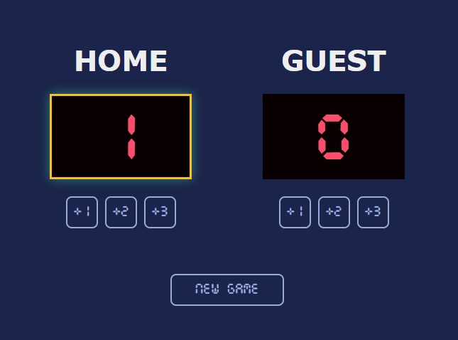
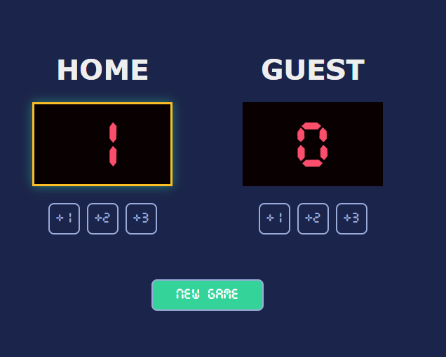

# 🏀 Basketball Game

A simple and fun and interactive **Basketball Game** project built as part of the [Scrimba Frontend Development Course](https://scrimba.com/).  
This project was created to practice **JavaScript fundamentals**

---

## 🚀 Features

- Two-player score tracking  
- Dynamic updates with JavaScript  
- Simple and clean UI design  
- Leading team highlight
- New game button

---

## 🖼️ Preview

Here are a few screenshots of the game in action:

|  |  |  |
|:---------------------------------------:|:---------------------------------------:|:---------------------------------------:|
| Scoreboard interface | Gameplay | New Game hover |

---

## 🧠 What I Learned

- How to use **JavaScript event listeners** to handle button clicks  
- Updating the DOM dynamically to reflect score changes  
- Writing clean, modular JavaScript code  
- Basic UI layout and styling with **CSS Flexbox**

---

## 💻 How to Run

1. Clone this repository:
   ```bash
   git clone https://github.com/hdnexus/scrimba-basketball-game-project.git
